# PyArchInit - Guida alla Configurazione

## Indice
1. [Introduzione](#introduzione)
2. [Accesso alla Configurazione](#accesso-alla-configurazione)
3. [Tab Parametri di Connessione](#tab-parametri-di-connessione)
4. [Tab Installazione DB](#tab-installazione-db)
5. [Tab Tool di Importazione](#tab-tool-di-importazione)
6. [Tab Graphviz](#tab-graphviz)
7. [Tab PostgreSQL](#tab-postgresql)
8. [Tab Help](#tab-help)
9. [Tab FTP to Lizmap](#tab-ftp-to-lizmap)

---

## Introduzione

La finestra di configurazione di PyArchInit permette di impostare tutti i parametri necessari per il corretto funzionamento del plugin. Prima di iniziare a documentare uno scavo archeologico, e necessario configurare correttamente la connessione al database e i percorsi delle risorse.

<!-- VIDEO: Introduzione alla configurazione di PyArchInit -->
<!-- Inserire link YouTube o percorso video locale -->
> **Video Tutorial**: [Inserire link video introduzione configurazione]

---

## Accesso alla Configurazione

Per accedere alla configurazione:
1. Aprire QGIS
2. Menu **PyArchInit** → **Config**

Oppure dalla toolbar di PyArchInit cliccare sull'icona **Impostazioni**.

<!-- IMMAGINE: Screenshot menu accesso configurazione -->

*Figura 1: Accesso alla finestra di configurazione dal menu PyArchInit*

<!-- IMMAGINE: Screenshot toolbar PyArchInit -->
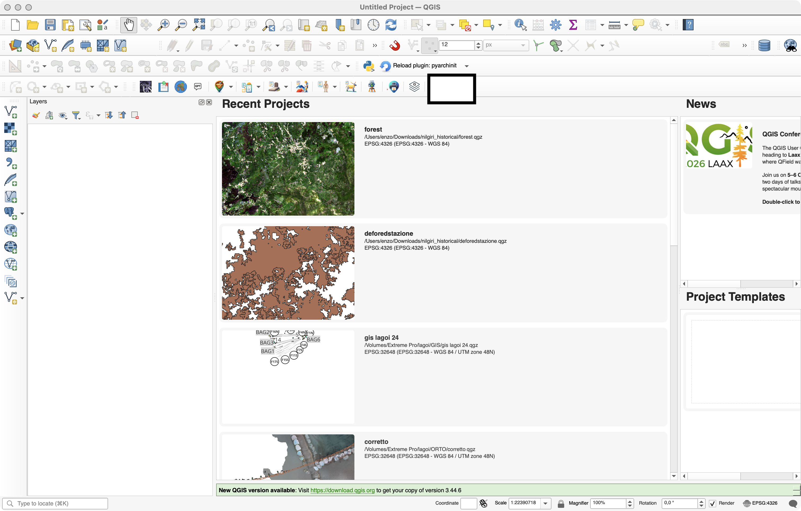
*Figura 2: Icona configurazione nella toolbar*

---

## Tab Parametri di Connessione

Questa e la scheda principale per configurare la connessione al database.

<!-- IMMAGINE: Screenshot completo tab Parametri di Connessione -->
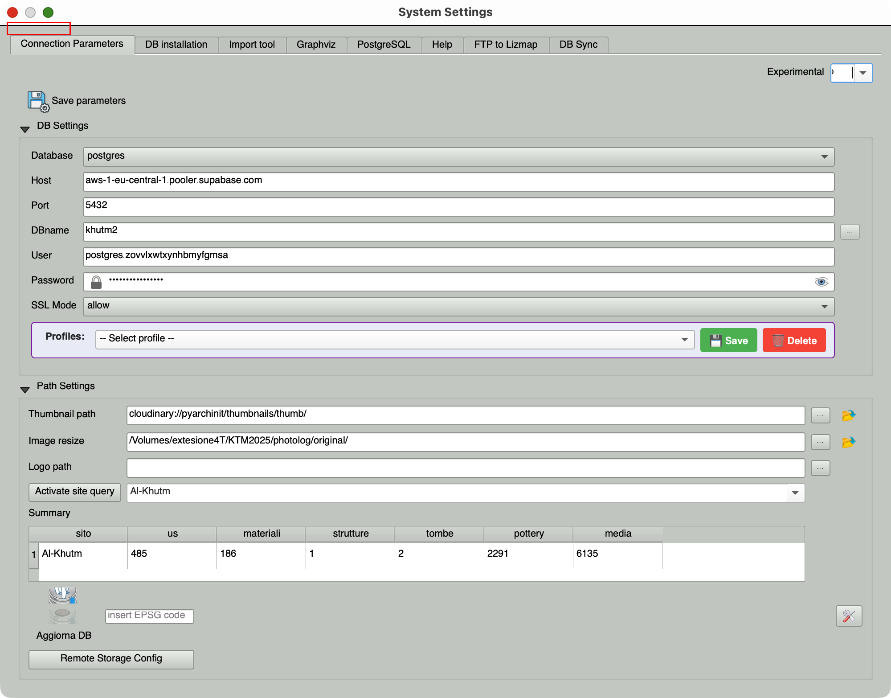
*Figura 3: Tab Parametri di Connessione - Vista completa*

### Sezione DB Settings

| Campo | Descrizione |
|-------|-------------|
| **Database** | Selezionare il tipo di database: `sqlite` (locale) o `postgres` (server) |
| **Host** | Indirizzo del server PostgreSQL (es. `localhost` o IP del server) |
| **DBname** | Nome del database (es. `pyarchinit`) |
| **Port** | Porta di connessione (default: `5432` per PostgreSQL) |
| **User** | Nome utente per la connessione |
| **Password** | Password dell'utente |
| **SSL Mode** | Modalita SSL per PostgreSQL: `allow`, `prefer`, `require`, `disable` |

<!-- IMMAGINE: Screenshot sezione DB Settings -->
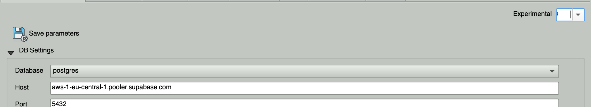
*Figura 4: Sezione DB Settings*

#### Scelta del Database

**SQLite/Spatialite** (Consigliato per uso singolo utente):
- Database locale, nessun server richiesto
- Ideale per progetti individuali o di piccole dimensioni
- Il file `.sqlite` viene salvato nella cartella `pyarchinit_DB_folder`

<!-- IMMAGINE: Screenshot configurazione SQLite -->

*Figura 5: Esempio configurazione per SQLite*

**PostgreSQL/PostGIS** (Consigliato per team):
- Database su server, accesso multi-utente
- Necessario avere PostgreSQL con estensione PostGIS installato
- Supporta la gestione utenti e permessi
- Ideale per progetti di grandi dimensioni con piu operatori

<!-- IMMAGINE: Screenshot configurazione PostgreSQL -->
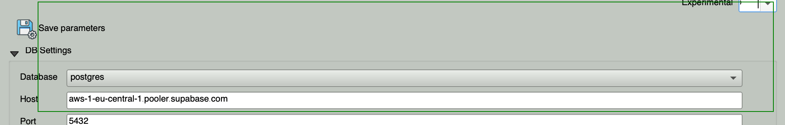
*Figura 6: Esempio configurazione per PostgreSQL*

<!-- VIDEO: Come configurare la connessione al database -->
> **Video Tutorial**: [Inserire link video configurazione database]

### Sezione Path Settings

| Campo | Descrizione | Bottone |
|-------|-------------|---------|
| **Thumbnail path** | Percorso dove salvare le miniature delle immagini | `...` per sfogliare |
| **Image resize** | Percorso per le immagini ridimensionate | `...` per sfogliare |
| **Logo path** | Percorso del logo personalizzato per i report | `...` per sfogliare |

<!-- IMMAGINE: Screenshot sezione Path Settings -->
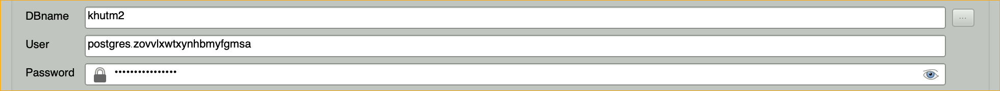
*Figura 7: Sezione Path Settings*

#### Percorsi Remoti Supportati

PyArchInit supporta anche storage remoto:
- **Google Drive**: `gdrive://folder/path/`
- **Dropbox**: `dropbox://folder/path/`
- **Amazon S3**: `s3://bucket/path/`
- **Cloudinary**: `cloudinary://cloud_name/folder/`
- **WebDAV**: `webdav://server/path/`
- **HTTP/HTTPS**: `https://server/path/`

<!-- IMMAGINE: Screenshot configurazione storage remoto -->
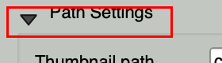
*Figura 8: Esempio configurazione storage remoto*

### Sezione Experimental

| Campo | Descrizione |
|-------|-------------|
| **Experimental** | Attiva funzionalita sperimentali (`Si`/`No`) |

### Sezione Attivazione Sito

| Campo | Descrizione |
|-------|-------------|
| **Attiva query sito** | Seleziona il sito attivo per filtrare i dati nelle schede |

Questa opzione e fondamentale quando si lavora con piu siti archeologici nello stesso database. Selezionando un sito, tutte le schede mostreranno solo i dati relativi a quel sito.

<!-- IMMAGINE: Screenshot selezione sito attivo -->
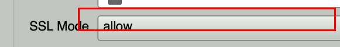
*Figura 9: Selezione del sito attivo*

### Bottoni Azione

| Bottone | Funzione |
|---------|----------|
| **Salva i parametri** | Salva tutte le impostazioni configurate |
| **Aggiorna DB** | Aggiorna lo schema del database esistente senza perdere dati |

### Funzioni di Allineamento Database

| Bottone | Descrizione |
|---------|-------------|
| **Allinea Postgres** | Allinea e aggiorna la struttura del database PostgreSQL |
| **Allinea Spatialite** | Allinea e aggiorna la struttura del database SQLite |
| **EPSG code** | Inserire il codice EPSG del sistema di riferimento del database |

<!-- IMMAGINE: Screenshot bottoni allineamento -->

*Figura 10: Bottoni per l'allineamento del database*

### Summary (Riepilogo)

La sezione Summary mostra un riepilogo delle impostazioni correnti in formato HTML.

<!-- IMMAGINE: Screenshot sezione Summary -->
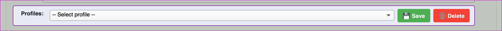
*Figura 11: Sezione Summary con riepilogo configurazione*

---

## Tab Installazione DB

Questa scheda permette di creare un nuovo database da zero.

<!-- IMMAGINE: Screenshot completo tab Installazione DB -->
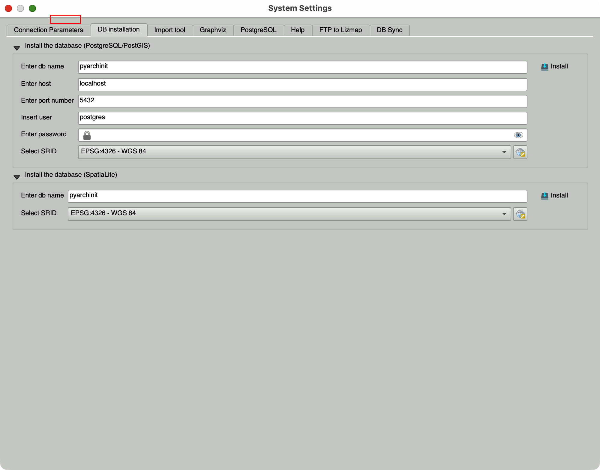
*Figura 12: Tab Installazione DB - Vista completa*

<!-- VIDEO: Come installare un nuovo database -->
> **Video Tutorial**: [Inserire link video installazione database]

### Installa il database (PostgreSQL/PostGIS)

| Campo | Descrizione |
|-------|-------------|
| **host** | Indirizzo del server (default: `localhost`) |
| **port (5432)** | Porta del server PostgreSQL |
| **user** | Utente con permessi di creazione database (es. `postgres`) |
| **password** | Password dell'utente |
| **db name** | Nome del nuovo database (default: `pyarchinit`) |
| **Seleziona SRID** | Sistema di riferimento spaziale (es. `4326` per WGS84, `32632` per UTM 32N) |

<!-- IMMAGINE: Screenshot installazione PostgreSQL -->
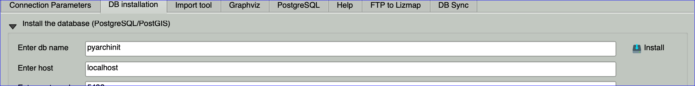
*Figura 13: Form installazione database PostgreSQL*

**Bottone Installa**: Crea il database con tutte le tabelle necessarie.

### Installa il database (SpatiaLite)

| Campo | Descrizione |
|-------|-------------|
| **db name** | Nome del file database (default: `pyarchinit`) |
| **Seleziona SRID** | Sistema di riferimento spaziale |

<!-- IMMAGINE: Screenshot installazione SQLite -->
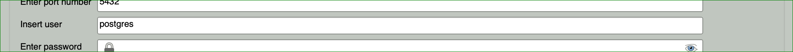
*Figura 14: Form installazione database SQLite*

**Bottone Installa**: Crea il database SQLite locale.

### SRID Comuni in Italia

| SRID | Descrizione |
|------|-------------|
| 4326 | WGS 84 (coordinate geografiche) |
| 32632 | WGS 84 / UTM zone 32N (Nord Italia) |
| 32633 | WGS 84 / UTM zone 33N (Centro-Sud Italia) |
| 3003 | Monte Mario / Italy zone 1 (Gauss-Boaga Ovest) |
| 3004 | Monte Mario / Italy zone 2 (Gauss-Boaga Est) |

<!-- IMMAGINE: Mappa zone UTM Italia -->

*Figura 15: Mappa delle zone UTM in Italia*

---

## Tab Tool di Importazione

Questa scheda permette di importare dati da altri database o file CSV.

<!-- IMMAGINE: Screenshot completo tab Tool di Importazione -->
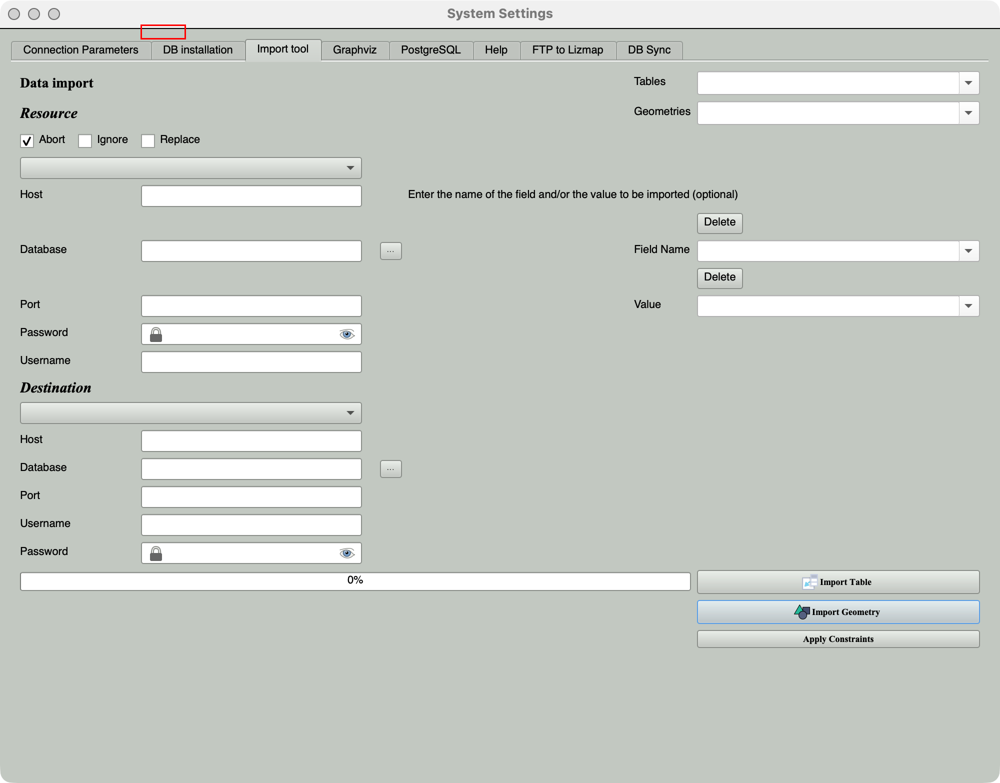
*Figura 16: Tab Tool di Importazione - Vista completa*

<!-- VIDEO: Come importare dati da un altro database -->
> **Video Tutorial**: [Inserire link video importazione dati]

### Sezione Importazione Dati

#### Database Sorgente (Risorsa)

| Campo | Descrizione |
|-------|-------------|
| **Database** | Tipo database sorgente (`sqlite` o `postgres`) |
| **Host/Port/Username/Password** | Credenziali per PostgreSQL sorgente |
| **...** | Seleziona file SQLite sorgente |

<!-- IMMAGINE: Screenshot database sorgente -->
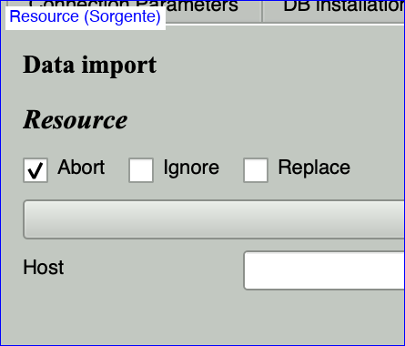
*Figura 17: Configurazione database sorgente*

#### Database Destinazione

| Campo | Descrizione |
|-------|-------------|
| **Database** | Tipo database destinazione |
| **Host/Port/Username/Password** | Credenziali per PostgreSQL destinazione |
| **...** | Seleziona file SQLite destinazione |

<!-- IMMAGINE: Screenshot database destinazione -->
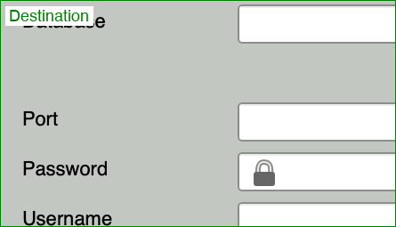
*Figura 18: Configurazione database destinazione*

### Tabelle Disponibili per Import

| Tabella | Descrizione |
|---------|-------------|
| SITE | Siti archeologici |
| US | Unita Stratigrafiche |
| PERIODIZZAZIONE | Periodizzazione e fasi |
| INVENTARIO_MATERIALI | Inventario reperti |
| TMA | Tabelle Materiali Archeologici |
| TMA_MATERIALI | Materiali TMA |
| POTTERY | Ceramica |
| STRUTTURA | Strutture |
| TOMBA | Tombe |
| PYARCHINIT_THESAURUS_SIGLE | Thesaurus sigle |
| SCHEDAIND | Schede individui antropologici |
| DETSESSO | Determinazione sesso |
| DETETA | Determinazione eta |
| ARCHEOZOOLOGY | Dati archeozoologici |
| CAMPIONI | Campioni |
| DOCUMENTAZIONE | Documentazione |
| MEDIA | File media |
| MEDIA_THUMB | Miniature media |
| MEDIATOENTITY | Relazioni media-entita |
| UT | Unita Topografiche |
| ALL | Tutte le tabelle |

### Opzioni di Import

| Opzione | Descrizione |
|---------|-------------|
| **Replace** | Sostituisce i record esistenti |
| **Ignore** | Ignora i duplicati |
| **Abort** | Interrompe in caso di errore |
| **Apply Constraints** | Applica vincoli di unicita al thesaurus |

<!-- IMMAGINE: Screenshot opzioni import -->

*Figura 19: Opzioni di importazione*

### Import Geometrie

| Layer | Descrizione |
|-------|-------------|
| PYSITO_POLYGON | Poligoni dei siti |
| PYSITO_POINT | Punti dei siti |
| PYUS | Unita Stratigrafiche |
| PYUSM | Unita Stratigrafiche Murarie |
| PYQUOTE | Quote |
| PYQUOTEUSM | Quote USM |
| PYUS_NEGATIVE | US negative |
| PYSTRUTTURE | Strutture |
| PYREPERTI | Reperti |
| PYINDIVIDUI | Individui |
| PYCAMPIONI | Campioni |
| PYTOMBA | Tombe |
| PYSEZIONI | Sezioni |
| PYDOCUMENTAZIONE | Documentazione |
| PYLINEERIFERIMENTO | Linee di riferimento |
| PYRIPARTIZIONI_SPAZIALI | Ripartizioni spaziali |

<!-- IMMAGINE: Screenshot import geometrie -->
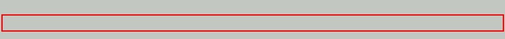
*Figura 20: Selezione layer per import geometrie*

### Bottoni

| Bottone | Funzione |
|---------|----------|
| **Import Table** | Importa i dati della tabella selezionata |
| **Import Geometry** | Importa le geometrie selezionate |
| **Converti db to spatialite** | Converte da PostgreSQL a SQLite |
| **Converti db to postgres** | Converte da SQLite a PostgreSQL |

---

## Tab Graphviz

Graphviz e necessario per generare i diagrammi del Matrix di Harris.

<!-- IMMAGINE: Screenshot tab Graphviz -->

*Figura 21: Tab Graphviz*

### Configurazione

| Campo | Descrizione |
|-------|-------------|
| **Percorso bin** | Percorso alla cartella `/bin` di Graphviz |
| **...** | Sfoglia per selezionare la cartella |
| **Salva** | Salva il percorso nella variabile d'ambiente PATH |

### Installazione Graphviz

**Windows**: Scaricare da https://graphviz.org/download/ e installare

<!-- IMMAGINE: Screenshot download Graphviz Windows -->

*Figura 22: Pagina download Graphviz*

**macOS**:
```bash
brew install graphviz
```

**Linux (Ubuntu/Debian)**:
```bash
sudo apt-get install graphviz
```

Se Graphviz e gia installato correttamente nel PATH di sistema, i campi saranno disabilitati automaticamente.

<!-- VIDEO: Installazione e configurazione Graphviz -->
> **Video Tutorial**: [Inserire link video Graphviz]

---

## Tab PostgreSQL

Configurazione del percorso di PostgreSQL per operazioni avanzate.

<!-- IMMAGINE: Screenshot tab PostgreSQL -->
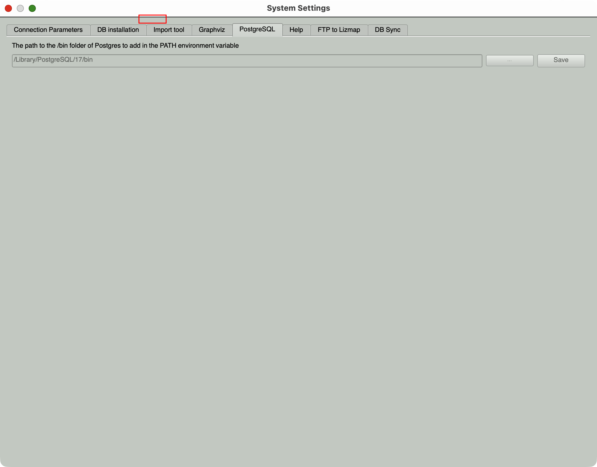
*Figura 23: Tab PostgreSQL*

| Campo | Descrizione |
|-------|-------------|
| **Percorso bin** | Percorso alla cartella `/bin` di PostgreSQL |
| **...** | Sfoglia per selezionare la cartella |
| **Salva** | Salva il percorso nella variabile d'ambiente PATH |

Necessario per operazioni come dump/restore del database.

---

## Tab Help

Contiene risorse di aiuto e documentazione.

<!-- IMMAGINE: Screenshot tab Help -->
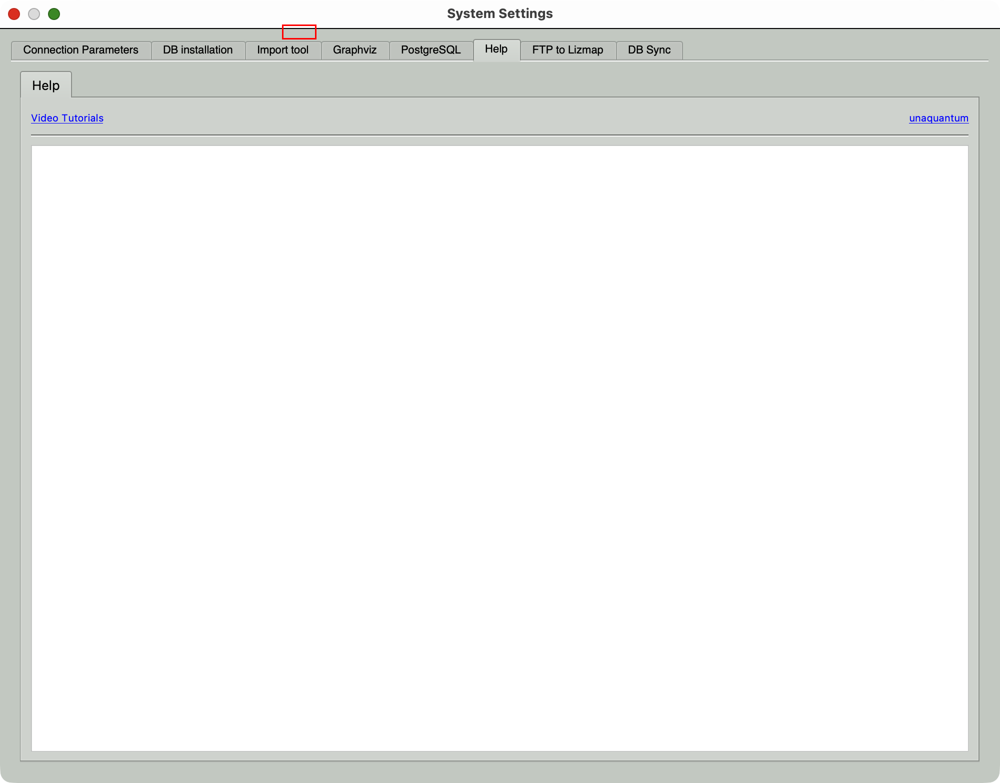
*Figura 24: Tab Help*

### Link Utili

| Risorsa | Descrizione |
|---------|-------------|
| **Video Tutorial** | Link ai video tutorial su YouTube |
| **Documentazione Online** | https://pyarchinit.github.io/pyarchinit_doc/index.html |
| **Facebook** | Pagina UnaQuantum |

### WebView

Area per visualizzare contenuti di help direttamente nel plugin.

---

## Tab FTP to Lizmap

Permette di pubblicare i dati su un server Lizmap per la visualizzazione web.

<!-- IMMAGINE: Screenshot tab FTP to Lizmap -->
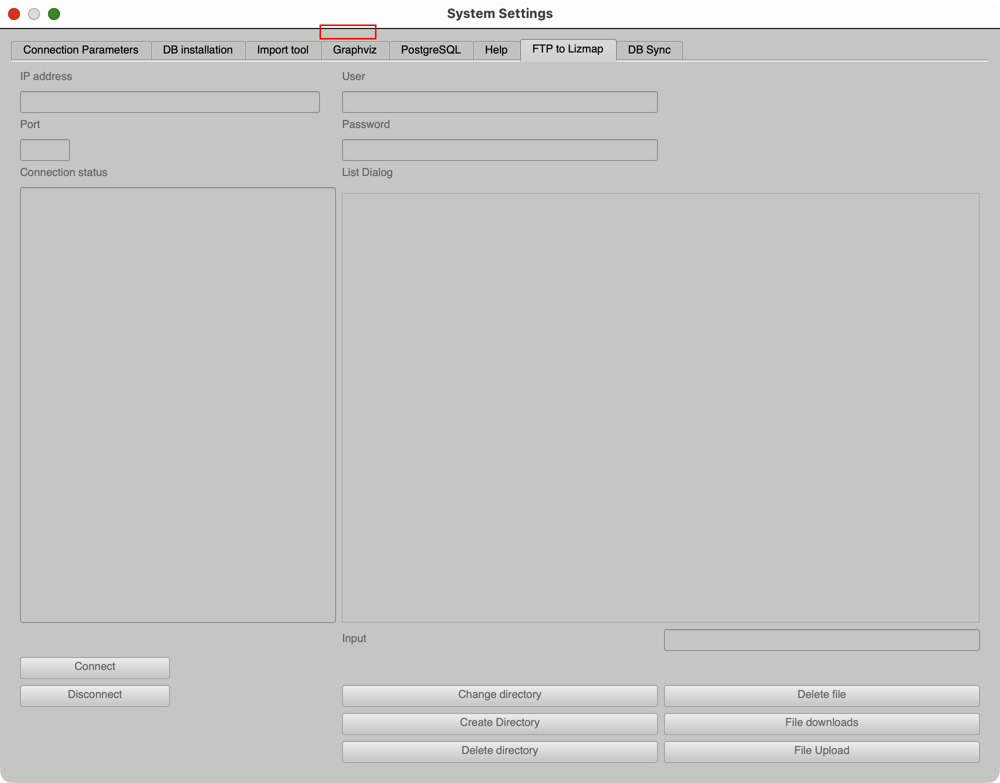
*Figura 25: Tab FTP to Lizmap*

<!-- VIDEO: Come pubblicare su Lizmap -->
> **Video Tutorial**: [Inserire link video Lizmap]

### Parametri di Connessione FTP

| Campo | Descrizione |
|-------|-------------|
| **ip address** | Indirizzo IP del server FTP |
| **Port** | Porta FTP (default: 21) |
| **User** | Nome utente FTP |
| **Password** | Password FTP |

### Operazioni Disponibili

| Bottone | Funzione |
|---------|----------|
| **Connect** | Connetti al server FTP |
| **Disconnect** | Disconnetti dal server |
| **Change directory** | Cambia directory corrente |
| **Create Directory** | Crea una nuova directory |
| **Upload file** | Carica un file sul server |
| **Download file** | Scarica un file dal server |
| **Delete file** | Elimina un file |
| **Delete directory** | Elimina una directory |

### Status

| Campo | Descrizione |
|-------|-------------|
| **Status connection** | Stato della connessione corrente |
| **Dialog List** | Lista dei file/directory nella posizione corrente |
| **Input** | Campo per inserire nomi file/directory |

---

## Funzioni Amministratore (Solo PostgreSQL)

Se connessi come amministratore, appare una sezione aggiuntiva:

<!-- IMMAGINE: Screenshot funzioni amministratore -->

*Figura 26: Sezione Funzioni Amministratore*

### Gestione Utenti e Permessi
Permette di creare, modificare ed eliminare utenti con diversi livelli di accesso.

<!-- IMMAGINE: Screenshot gestione utenti -->

*Figura 27: Dialog gestione utenti*

### Monitor Attivita Real-Time
Visualizza in tempo reale le attivita sul database e gli utenti connessi.

<!-- IMMAGINE: Screenshot monitor attivita -->

*Figura 28: Monitor attivita in tempo reale*

### Aggiorna Schema Database
Applica aggiornamenti allo schema senza perdere dati.

### Applica Sistema Concorrenza
Aggiunge il sistema di controllo concorrenza per evitare conflitti di modifica.

---

## Advance Setting (Comparazione Database)

Nella parte superiore della scheda principale, c'e una sezione per confrontare database SQLite:

<!-- IMMAGINE: Screenshot advance settings -->

*Figura 29: Sezione Advance Settings*

| Opzione | Descrizione |
|---------|-------------|
| **--schema** | Confronta solo lo schema |
| **--summary** | Mostra un riepilogo |
| **--changeset FILE** | Genera un file con le modifiche |

| Bottone | Funzione |
|---------|----------|
| **Convert** | Converte in Spatialite v5 |
| **Converti in Spatialite v5** | Aggiorna formato database |
| **Confronta db** | Confronta due database |

---

## Workflow Consigliato per Nuovo Progetto

<!-- VIDEO: Workflow completo configurazione nuovo progetto -->
> **Video Tutorial**: [Inserire link video workflow completo]

1. **Aprire la Configurazione** dal menu PyArchInit

<!-- IMMAGINE: Step 1 -->

*Figura 30: Step 1 - Apertura configurazione*

2. **Scegliere il tipo di database** (SQLite per uso singolo, PostgreSQL per team)

<!-- IMMAGINE: Step 2 -->

*Figura 31: Step 2 - Scelta tipo database*

3. **Tab Installazione DB**: Creare un nuovo database con il SRID appropriato

<!-- IMMAGINE: Step 3 -->

*Figura 32: Step 3 - Installazione database*

4. **Tab Parametri di Connessione**: Configurare i parametri di connessione

<!-- IMMAGINE: Step 4 -->

*Figura 33: Step 4 - Configurazione parametri*

5. **Impostare i percorsi** per thumbnail, resize e logo

<!-- IMMAGINE: Step 5 -->

*Figura 34: Step 5 - Impostazione percorsi*

6. **Salvare i parametri**

<!-- IMMAGINE: Step 6 -->

*Figura 35: Step 6 - Salvataggio parametri*

7. **Testare la connessione** aprendo una scheda qualsiasi (es. Sito)

<!-- IMMAGINE: Step 7 -->

*Figura 36: Step 7 - Test connessione con scheda Sito*

---

## Risoluzione Problemi Comuni

### Errore di connessione PostgreSQL

<!-- IMMAGINE: Screenshot errore connessione -->

*Figura 37: Esempio errore di connessione*

- Verificare che il server PostgreSQL sia avviato
- Controllare host, porta e credenziali
- Verificare che l'estensione PostGIS sia installata

### Database SQLite non trovato
- Verificare che il file esista nella cartella `pyarchinit_DB_folder`
- Controllare i permessi di lettura/scrittura

### Graphviz non funziona
- Verificare l'installazione di Graphviz
- Impostare manualmente il percorso nella tab Graphviz
- Riavviare QGIS dopo la configurazione

### Immagini non visualizzate
- Verificare i percorsi Thumbnail path e Image resize
- Controllare che le cartelle esistano e siano accessibili

---

## Note Tecniche

- Le impostazioni sono salvate nelle QgsSettings di QGIS
- Il database predefinito e `Home/pyarchint/pyarchinit_DB_folder/pyarchinit_db.sqlite`
- I log di debug sono salvati in `[TEMP]/pyarchinit_debug.log`
- La variabile d'ambiente `PYARCHINIT_HOME` punta alla cartella `pyarchinit` installata nella Home dell'utente

---

## Lista Immagini da Inserire

Per completare questa documentazione, inserire le seguenti immagini nella cartella `images/01_configurazione/`:

| Nome File | Descrizione |
|-----------|-------------|
| `01_menu_config.png` | Screenshot menu accesso configurazione |
| `02_toolbar_config.png` | Screenshot toolbar PyArchInit |
| `03_tab_parametri_connessione.png` | Tab Parametri di Connessione completo |
| `04_db_settings.png` | Sezione DB Settings |
| `05_config_sqlite.png` | Esempio configurazione SQLite |
| `06_config_postgres.png` | Esempio configurazione PostgreSQL |
| `07_path_settings.png` | Sezione Path Settings |
| `08_remote_storage.png` | Configurazione storage remoto |
| `09_selezione_sito.png` | Selezione sito attivo |
| `10_allineamento_db.png` | Bottoni allineamento database |
| `11_summary.png` | Sezione Summary |
| `12_tab_installazione_db.png` | Tab Installazione DB completo |
| `13_install_postgres.png` | Form installazione PostgreSQL |
| `14_install_sqlite.png` | Form installazione SQLite |
| `15_zone_utm_italia.png` | Mappa zone UTM Italia |
| `16_tab_importazione.png` | Tab Tool Importazione completo |
| `17_db_sorgente.png` | Configurazione database sorgente |
| `18_db_destinazione.png` | Configurazione database destinazione |
| `19_opzioni_import.png` | Opzioni di importazione |
| `20_import_geometrie.png` | Selezione layer import geometrie |
| `21_tab_graphviz.png` | Tab Graphviz |
| `22_graphviz_download.png` | Pagina download Graphviz |
| `23_tab_postgresql.png` | Tab PostgreSQL |
| `24_tab_help.png` | Tab Help |
| `25_tab_ftp_lizmap.png` | Tab FTP to Lizmap |
| `26_funzioni_admin.png` | Sezione Funzioni Amministratore |
| `27_gestione_utenti.png` | Dialog gestione utenti |
| `28_monitor_attivita.png` | Monitor attivita |
| `29_advance_settings.png` | Sezione Advance Settings |
| `30_workflow_step1.png` | Workflow Step 1 |
| `31_workflow_step2.png` | Workflow Step 2 |
| `32_workflow_step3.png` | Workflow Step 3 |
| `33_workflow_step4.png` | Workflow Step 4 |
| `34_workflow_step5.png` | Workflow Step 5 |
| `35_workflow_step6.png` | Workflow Step 6 |
| `36_workflow_step7.png` | Workflow Step 7 |
| `37_errore_connessione.png` | Esempio errore connessione |

## Lista Video da Inserire

| Placeholder | Descrizione |
|-------------|-------------|
| Video introduzione configurazione | Panoramica generale della configurazione |
| Video configurazione database | Come configurare SQLite e PostgreSQL |
| Video installazione database | Come creare un nuovo database |
| Video importazione dati | Come importare dati da altri database |
| Video Graphviz | Installazione e configurazione Graphviz |
| Video Lizmap | Come pubblicare su Lizmap |
| Video workflow completo | Configurazione completa passo-passo |

---

*Documentazione PyArchInit - Scheda Configurazione*
*Versione: 4.9.x*
*Ultimo aggiornamento: Gennaio 2026*

---

## Animazione Interattiva

Esplora l'animazione interattiva per comprendere meglio il processo di installazione e configurazione.

[Apri Animazione Installazione](../../animations/pyarchinit_installation_animation.html)

Esplora l'animazione interattiva per la gestione dello storage remoto.

[Apri Animazione Storage Remoto](../../animations/pyarchinit_remote_storage_animation.html)
